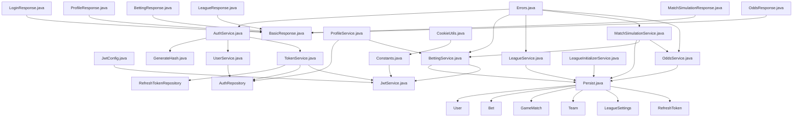

# Sportsbook & Simulation Engine Architecture

```mermaid
graph TD

%% =====================
%% Security Layer
%% =====================

JwtConfig[JwtConfig.java] --> JwtService[JwtService.java]
Constants[Constants.java] --> JwtService

%% =====================
%% Core Authentication
%% =====================

AuthService[AuthService.java] --> GenerateHash[GenerateHash.java]
AuthService --> UserService[UserService.java]
AuthService --> TokenService[TokenService.java]

UserService --> AuthRepository

TokenService --> RefreshTokenRepository
TokenService --> AuthRepository
TokenService --> JwtService

%% =====================
%% Database Entities
%% =====================

User[User]
Bet[Bet]
GameMatch[GameMatch]
Team[Team]
LeagueSettings[LeagueSettings]
RefreshToken[RefreshToken]

%% =====================
%% Persistence Layer
%% =====================

Persist[Persist.java]
AuthRepository
RefreshTokenRepository

Persist --> User
Persist --> Bet
Persist --> GameMatch
Persist --> Team
Persist --> LeagueSettings
Persist --> RefreshToken

%% =====================
%% Sportsbook Services
%% =====================

BettingService[BettingService.java] --> Persist
BettingService --> JwtService

MatchSimulationService[MatchSimulationService.java] --> Persist
MatchSimulationService --> BettingService
MatchSimulationService --> OddsService

OddsService[OddsService.java] --> Persist

LeagueService[LeagueService.java] --> Persist

LeagueInitializerService[LeagueInitializerService.java] --> Persist

%% =====================
%% Utilities
%% =====================

ProfileService[ProfileService.java] --> AuthRepository
ProfileService --> BettingService

CookieUtils[CookieUtils.java] --> Constants

Errors[Errors.java] --> AuthService
Errors --> BettingService
Errors --> LeagueService
Errors --> MatchSimulationService
Errors --> OddsService

%% =====================
%% DTO Hierarchy
%% =====================

BasicResponse[BasicResponse.java]

LoginResponse[LoginResponse.java] --> BasicResponse
ProfileResponse[ProfileResponse.java] --> BasicResponse
BettingResponse[BettingResponse.java] --> BasicResponse
LeagueResponse[LeagueResponse.java] --> BasicResponse
MatchSimulationResponse[MatchSimulationResponse.java] --> BasicResponse
OddsResponse[OddsResponse.java] --> BasicResponse
```
