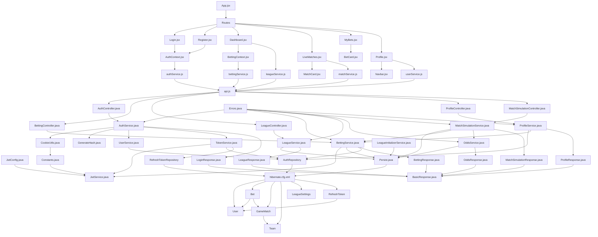

## 🕸️ Full Project Relationship Graph

```mermaid
graph TD

%% FRONTEND
App[App.jsx] --> Routes[Routes]
Routes --> Login[Login.jsx]
Routes --> Register[Register.jsx]
Routes --> Dashboard[Dashboard.jsx]
Routes --> LiveMatches[LiveMatches.jsx]
Routes --> MyBets[MyBets.jsx]
Routes --> Profile[Profile.jsx]

Login --> AuthContext[AuthContext.jsx]
Register --> AuthContext
Dashboard --> BettingContext[BettingContext.jsx]
LiveMatches --> MatchCard[MatchCard.jsx]
MyBets --> BetCard[BetCard.jsx]
Profile --> Navbar[Navbar.jsx]

AuthContext --> authService[authService.js]
BettingContext --> bettingService[bettingService.js]
LiveMatches --> matchService[matchService.js]
Dashboard --> leagueService[leagueService.js]
Profile --> userService[userService.js]

authService --> api[api.js]
bettingService --> api
matchService --> api
leagueService --> api
userService --> api

api --> AuthController[AuthController.java]
api --> BettingController[BettingController.java]
api --> LeagueController[LeagueController.java]
api --> ProfileController[ProfileController.java]
api --> MatchSimulationController[MatchSimulationController.java]

%% BACKEND CONTROLLERS
AuthController --> AuthService[AuthService.java]
BettingController --> BettingService[BettingService.java]
LeagueController --> LeagueService[LeagueService.java]
ProfileController --> ProfileService[ProfileService.java]
MatchSimulationController --> MatchSimulationService[MatchSimulationService.java]

%% SECURITY
JwtConfig[JwtConfig.java] --> JwtService[JwtService.java]
Constants[Constants.java] --> JwtService
CookieUtils[CookieUtils.java] --> Constants
AuthService --> CookieUtils
AuthService --> GenerateHash[GenerateHash.java]
AuthService --> UserService[UserService.java]
AuthService --> TokenService[TokenService.java]

%% AUTH SERVICES
TokenService --> JwtService
TokenService --> AuthRepository[AuthRepository]
TokenService --> RefreshTokenRepository[RefreshTokenRepository]
UserService --> AuthRepository

%% SPORTSBOOK SERVICES
BettingService --> JwtService
BettingService --> Persist[Persist.java]
BettingService --> AuthRepository

MatchSimulationService --> Persist
MatchSimulationService --> BettingService
MatchSimulationService --> OddsService[OddsService.java]

OddsService --> Persist
LeagueService --> Persist
LeagueInitializerService[LeagueInitializerService.java] --> Persist

ProfileService --> AuthRepository
ProfileService --> BettingService

%% PERSISTENCE
Persist --> hibernate[hibernate.cfg.xml]
AuthRepository --> hibernate
RefreshTokenRepository --> hibernate

%% ENTITIES
hibernate --> User[User]
hibernate --> Bet[Bet]
hibernate --> GameMatch[GameMatch]
hibernate --> Team[Team]
hibernate --> LeagueSettings[LeagueSettings]
hibernate --> RefreshToken[RefreshToken]

Bet --> User
Bet --> GameMatch
GameMatch --> Team
RefreshToken --> User

%% RESPONSES
LoginResponse[LoginResponse.java] --> BasicResponse[BasicResponse.java]
ProfileResponse[ProfileResponse.java] --> BasicResponse
BettingResponse[BettingResponse.java] --> BasicResponse
LeagueResponse[LeagueResponse.java] --> BasicResponse
MatchSimulationResponse[MatchSimulationResponse.java] --> BasicResponse
OddsResponse[OddsResponse.java] --> BasicResponse

AuthService --> LoginResponse
ProfileService --> ProfileResponse
BettingService --> BettingResponse
LeagueService --> LeagueResponse
MatchSimulationService --> MatchSimulationResponse
OddsService --> OddsResponse

%% ERRORS
Errors[Errors.java] --> AuthService
Errors --> BettingService
Errors --> LeagueService
Errors --> MatchSimulationService
Errors --> OddsService
Errors --> ProfileService
```
